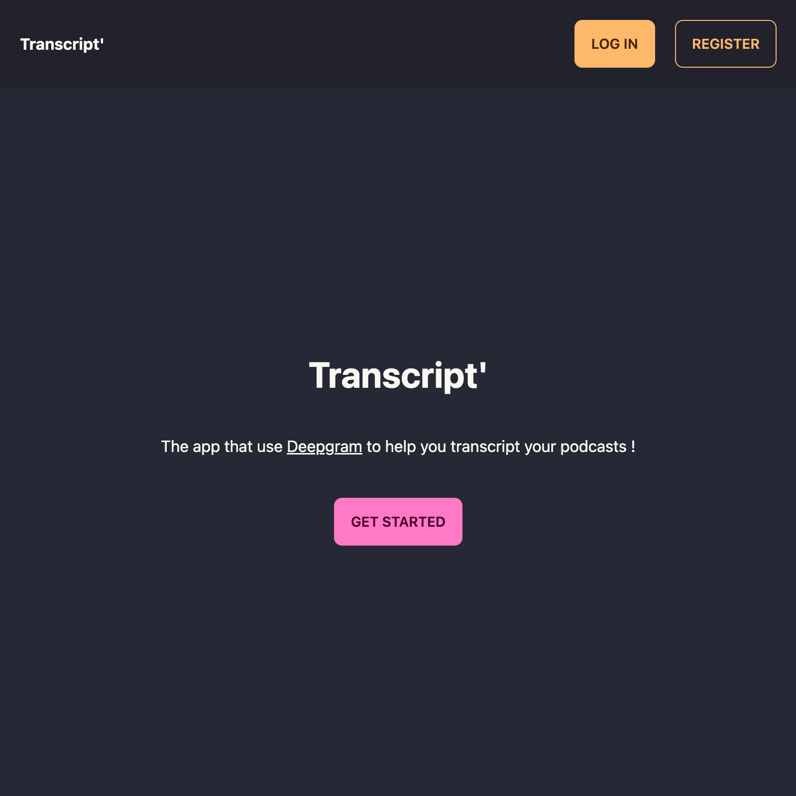
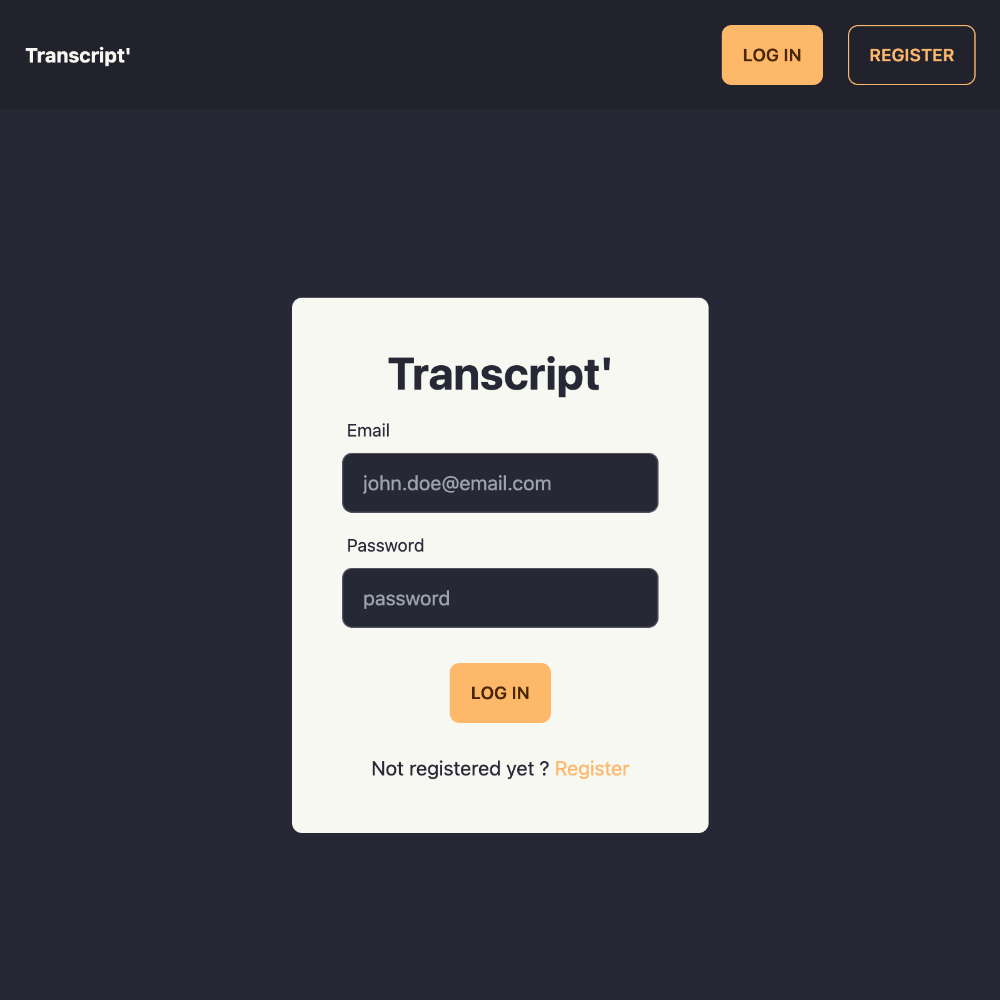
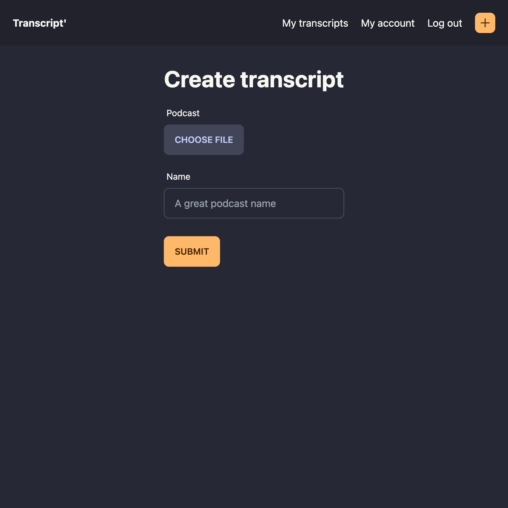
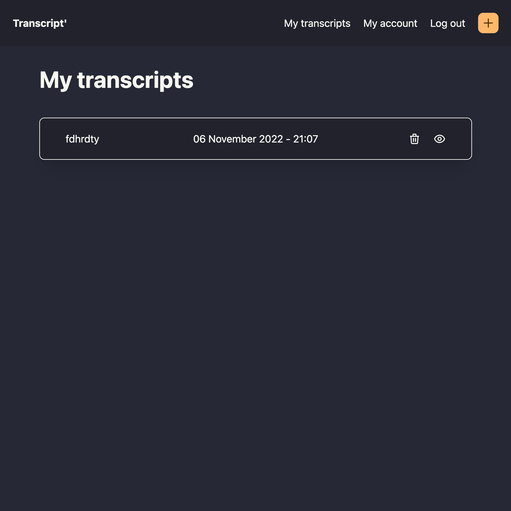
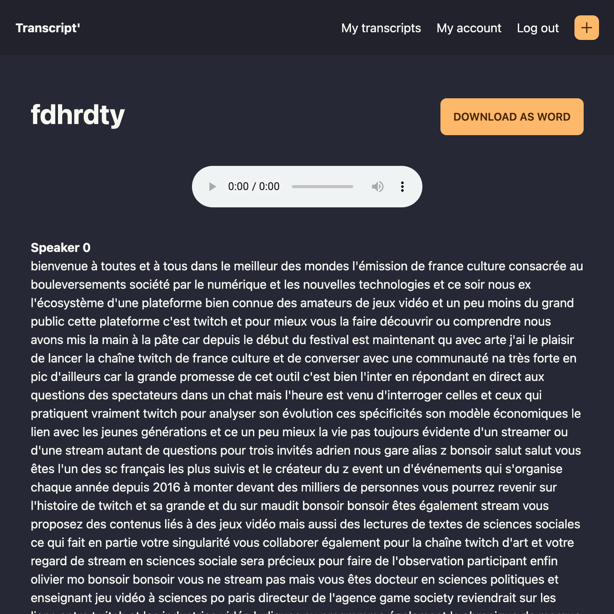

# Transcript'

Transcript' allow you to transform audio into text using Deepgram API and Appwrite.

## 🧰 Tech Stack
- [Appwrite](https://appwrite.io)
- [Deepgram](https://deepgram.com)
- [Daisy UI](https://daisyui.com)
- [Vue 3](https://vuejs.org)

## 🛠️ Setup
1. Setup [Appwrite](https://appwrite.io/) 1.0
2. Create project with ID `transcript`
3. Use [Appwrite CLI](https://appwrite.io/docs/command-line) and run `appwrite deploy collection --all` and `appwrite deploy function --all`
4. Create 2 buckets in Appwrite, add the full permission to role users and fill their IDs in .env (that you created from .env.example):
   - Audio (in `VITE_AUDIO_BUCK_ID`)
   - Transcript (in `VITE_TRANSCRIPT_BUCK_ID`)
5. Fill the function variables :
   - For "Get Full Transcript" :
       - `APPWRITE_FUNCTION_ENDPOINT` : `http://host.docker.internal/v1`
       - `APPWRITE_TRANSCRIPT_BUCKET_ID` : with the Transcript bucket id
   - For "Transcript Audio" :
     - `APPWRITE_FUNCTION_ENDPOINT` : `http://host.docker.internal/v1`
     - `APPWRITE_TRANSCRIPT_BUCKET_ID` : with the Transcript bucket id
     - `APPWRITE_FUNCTION_DEEPGRAM_KEY` : with a Deepgram Api Key (for help see [here](https://developers.deepgram.com/documentation/getting-started/authentication/))
6. You're done !

## 🏠 Development
1. Install dependencies `yarn`
2. Start Vue server `yarn dev`

## 🚀 Production
Build project using `yarn build`

## 🖼️ Screenshots

